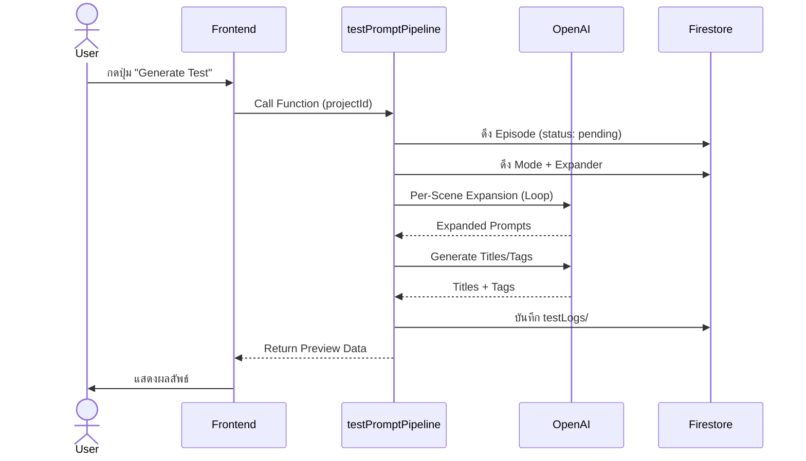
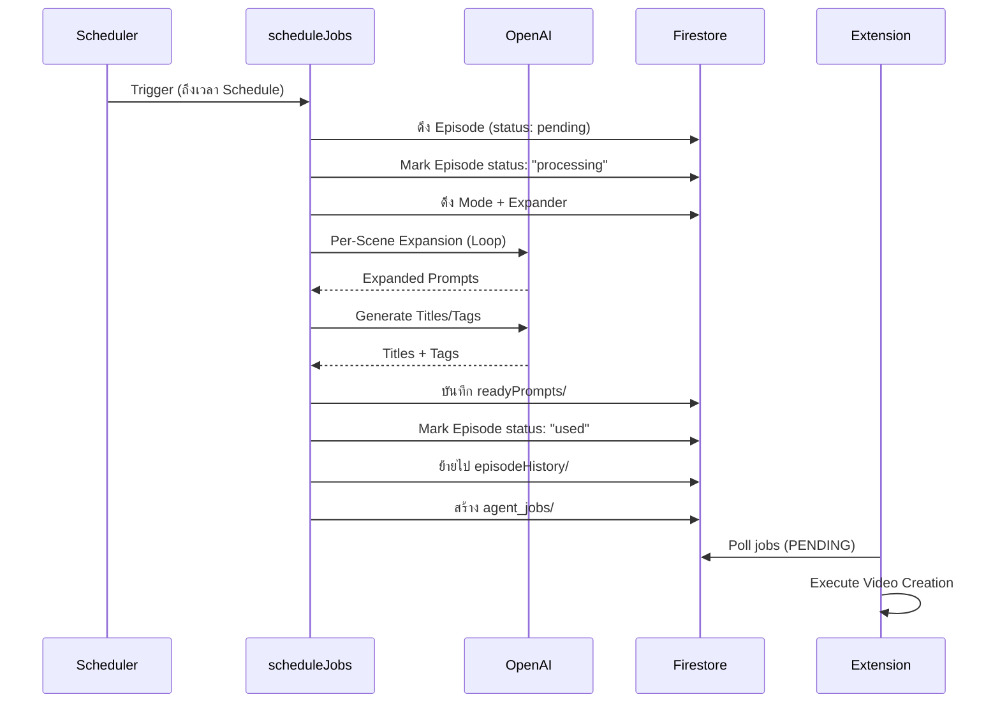

# 📖 Walkthrough: Content Queue & Prompt Pipeline System

> เอกสารนี้อธิบายการทำงานของระบบ **Content Queue** และ **Prompt Pipeline** อย่างละเอียด
> เพื่อให้เข้าใจภาพรวมก่อนเริ่ม Implement

---

## 📌 สารบัญ (Table of Contents)

1. [ภาพรวมระบบ (System Overview)](#1-ภาพรวมระบบ)
2. [Data Flow: จาก Episode → Video](#2-data-flow)
3. [Database Schema](#3-database-schema)
4. [Phase 1: Prompt Pipeline](#4-phase-1-prompt-pipeline)
5. [Phase 2: Episode Queue Management](#5-phase-2-episode-queue)
6. [Phase 3: Auto-Refill System](#6-phase-3-auto-refill)
7. [Phase 4: Frontend UI](#7-phase-4-frontend-ui)
8. [Testing Strategy](#8-testing-strategy)

---

## 1. ภาพรวมระบบ

### 🎯 ปัญหาที่แก้ไข

| ปัญหาเดิม | สิ่งที่ต้องการ |
|:----------|:-------------|
| Generate Test ไม่เหมือน Production | ใช้ Logic เดียวกัน (Shared Code) |
| Episode ไม่ถูกนำไปใช้ใน Prompt | ดึง Episode มาเป็น Topic หลัก |
| ไม่รู้ว่า Episode ไหนใช้แล้ว | ระบบ Status + History |
| Episode หมด ต้องเติมเอง | Auto-Generate เมื่อเหลือน้อย |

### 🏗️ Architecture Overview

```
┌─────────────────────────────────────────────────────────────────────┐
│                        CONTENT AUTO POST                            │
├─────────────────────────────────────────────────────────────────────┤
│                                                                     │
│  ┌───────────────┐     ┌───────────────┐     ┌───────────────┐     │
│  │  Content      │     │   Prompt      │     │  Extension    │     │
│  │  Queue (UI)   │────▶│   Pipeline    │────▶│  (Executor)   │     │
│  │               │     │   (Backend)   │     │               │     │
│  └───────────────┘     └───────────────┘     └───────────────┘     │
│         │                     │                     │               │
│         ▼                     ▼                     ▼               │
│  ┌─────────────────────────────────────────────────────────────┐   │
│  │                     FIREBASE (Firestore)                    │   │
│  │  episodes/ │ testLogs/ │ readyPrompts/ │ episodeHistory/    │   │
│  └─────────────────────────────────────────────────────────────┘   │
│                                                                     │
└─────────────────────────────────────────────────────────────────────┘
```

---

## 2. Data Flow

### 2.1 Generate Test Flow (ทดสอบ)



**สำคัญ:** ไม่เปลี่ยน Status ของ Episode (ยังเป็น pending)

---

### 2.2 Schedule (Production) Flow



**สำคัญ:** เปลี่ยน Status และย้าย Episode ไป History

---

## 3. Database Schema

### 3.1 Episodes Collection

```
/users/{uid}/projects/{projectId}/episodes/{episodeId}
```

| Field | Type | Description | Example |
|:------|:-----|:------------|:--------|
| `title` | string | ชื่อ Episode | "ชีวิตของแมว" |
| `description` | string | คำอธิบาย | "สารคดีเกี่ยวกับแมว" |
| `order` | number | ลำดับ (สำหรับ Sequential) | 1 |
| `status` | string | สถานะปัจจุบัน | "pending" / "processing" / "used" |
| `createdAt` | timestamp | วันที่สร้าง | 2026-01-19T... |
| `usedAt` | timestamp | วันที่ใช้งาน | null |
| `jobId` | string | Job ที่ใช้ Episode นี้ | null |

---

### 3.2 Test Logs Collection

```
/users/{uid}/projects/{projectId}/testLogs/{logId}
```

| Field | Type | Description |
|:------|:-----|:------------|
| `prompts` | array | Expanded Prompts ทั้งหมด |
| `titles` | object | { tiktok, youtube, instagram, facebook } |
| `tags` | object | { tiktok, youtube, instagram, facebook } |
| `episodeId` | string | Episode ที่ใช้ทดสอบ |
| `episodeTitle` | string | ชื่อ Episode |
| `modeId` | string | Mode ที่ใช้ |
| `expanderId` | string | Expander ที่ใช้ |
| `createdAt` | timestamp | วันที่สร้าง |
| `expiresAt` | timestamp | วันหมดอายุ (TTL) |

---

### 3.3 Ready Prompts Collection (Production)

```
/users/{uid}/projects/{projectId}/readyPrompts/{docId}
```

| Field | Type | Description |
|:------|:-----|:------------|
| `prompts` | array | Expanded Prompts พร้อมใช้ |
| `titles` | object | Titles สำหรับแต่ละ Platform |
| `tags` | object | Tags สำหรับแต่ละ Platform |
| `episodeId` | string | Episode ที่ใช้ |
| `jobId` | string | Job ID ที่สร้าง |
| `status` | string | "ready" / "executing" / "completed" |
| `createdAt` | timestamp | วันที่สร้าง |

---

### 3.4 Episode History Collection

```
/users/{uid}/projects/{projectId}/episodeHistory/{historyId}
```

| Field | Type | Description |
|:------|:-----|:------------|
| `title` | string | ชื่อ Episode |
| `description` | string | คำอธิบาย |
| `originalOrder` | number | ลำดับเดิม |
| `usedAt` | timestamp | วันที่ใช้งาน |
| `jobId` | string | Job ID ที่ใช้ |
| `generatedPrompts` | array | Prompts ที่สร้างขึ้น |
| `wasSuccessful` | boolean | สำเร็จหรือไม่ |

---

### 3.5 Project Settings (เพิ่มเติม)

```
/users/{uid}/projects/{projectId}
```

| Field | Type | Description | Default |
|:------|:-----|:------------|:--------|
| `episodeSelection` | string | "sequential" / "random" | "sequential" |
| `autoRefillEnabled` | boolean | เปิด Auto-Generate | false |
| `autoRefillThreshold` | number | เหลือเท่าไหร่ถึง Trigger | 5 |
| `autoRefillCount` | number | สร้างครั้งละกี่ Episode | 10 |
| `autoRefillPrompt` | string | คำสั่งให้ AI สร้าง | "" |

---

## 4. Phase 1: Prompt Pipeline

### 4.1 ปัญหาปัจจุบัน

ดูตัวอย่างเปรียบเทียบ Code:

**ปัจจุบัน (testPromptPipeline):**
```javascript
// ส่งให้ AI สร้าง Prompt ทั้งหมดในครั้งเดียว (Bulk)
const response = await openai.chat.completions.create({
  messages: [
    { role: 'system', content: 'สร้าง Prompt ทีเดียวจบ...' },
    { role: 'user', content: sceneInputs }  // ส่งทุก Scene รวมกัน
  ]
});
```

**ที่ต้องการ (Production-like):**
```javascript
// วน Loop ขยายทีละ Scene (Per-Scene)
const expandedPrompts = [];
for (const scene of scenes) {
  const response = await openai.chat.completions.create({
    messages: [
      { role: 'system', content: `ขยาย Scene นี้... Topic: "${episodeTopic}"` },
      { role: 'user', content: scene.rawPrompt }
    ]
  });
  expandedPrompts.push(response.choices[0].message.content);
}
```

---

### 4.2 Shared Logic Function

สร้าง Function กลางที่ทั้ง Test และ Production ใช้ร่วมกัน:

```javascript
// functions/index.js

/**
 * Expand Scenes with Episode Topic
 * ใช้ร่วมกันระหว่าง testPromptPipeline และ scheduleJobs
 */
async function expandScenesWithTopic(params) {
  const { 
    modeData,           // Mode Template
    expanderBlocks,     // Expander Rules
    episodeTopic,       // หัวข้อจาก Episode
    episodeDesc,        // คำอธิบาย Episode
    sceneDuration = 8   // ความยาวต่อ Scene (วินาที)
  } = params;

  const openai = getOpenAI();
  const expandedPrompts = [];

  // ดึง Scene Templates จาก Mode
  const rawScenes = extractScenesFromMode(modeData);

  // วน Loop ขยายทีละ Scene
  for (let i = 0; i < rawScenes.length; i++) {
    const scene = rawScenes[i];
    
    const systemPrompt = buildExpanderSystemPrompt({
      expanderBlocks,
      episodeTopic,
      episodeDesc,
      sceneDuration,
      sceneNumber: i + 1,
      totalScenes: rawScenes.length
    });

    const response = await openai.chat.completions.create({
      model: 'gpt-4o',
      messages: [
        { role: 'system', content: systemPrompt },
        { role: 'user', content: `Scene: ${scene.title}\nTemplate: ${scene.rawPrompt || scene.title}` }
      ],
      temperature: 0.7,
      max_tokens: 800
    });

    expandedPrompts.push({
      sceneNumber: i + 1,
      englishPrompt: response.choices[0].message.content.trim(),
      originalPrompt: scene.rawPrompt || scene.title,
      audioDescription: scene.audioInstruction || 'Ambient sounds'
    });
  }

  return expandedPrompts;
}
```

---

## 5. Phase 2: Episode Queue

### 5.1 Episode Selection Logic

```javascript
// ดึง Episode ตามโหมดที่ตั้งไว้
async function getNextEpisode(projectRef, selectionMode) {
  let query = projectRef.collection('episodes')
    .where('status', '==', 'pending');

  if (selectionMode === 'sequential') {
    // เรียงตามลำดับ แล้วเอาตัวแรก
    query = query.orderBy('order', 'asc').limit(1);
  } else {
    // Random: ดึงมาทั้งหมดแล้วสุ่ม
    const snapshot = await query.get();
    if (snapshot.empty) return null;
    
    const randomIndex = Math.floor(Math.random() * snapshot.size);
    return {
      id: snapshot.docs[randomIndex].id,
      ...snapshot.docs[randomIndex].data()
    };
  }

  const snapshot = await query.get();
  if (snapshot.empty) return null;
  
  return {
    id: snapshot.docs[0].id,
    ...snapshot.docs[0].data()
  };
}
```

---

### 5.2 Status Transition

```
┌─────────┐     ┌────────────┐     ┌──────┐
│ pending │────▶│ processing │────▶│ used │
└─────────┘     └────────────┘     └──────┘
     │                                  │
     │          (Generate Test)         │
     └──────────────────────────────────┘
                 ไม่เปลี่ยน Status
```

**Code สำหรับเปลี่ยน Status:**

```javascript
// Mark as Processing (เมื่อเริ่มทำงาน)
await episodeRef.update({
  status: 'processing',
  processingStartedAt: admin.firestore.FieldValue.serverTimestamp()
});

// Mark as Used + Move to History (เมื่อสำเร็จ)
const episodeData = (await episodeRef.get()).data();
await db.collection('users').doc(userId)
  .collection('projects').doc(projectId)
  .collection('episodeHistory').add({
    ...episodeData,
    usedAt: admin.firestore.FieldValue.serverTimestamp(),
    jobId: jobId,
    generatedPrompts: expandedPrompts
  });

await episodeRef.delete();  // หรือ update status แล้วซ่อนใน UI
```

---

## 6. Phase 3: Auto-Refill

### 6.1 Trigger Condition

```javascript
// ใน scheduleJobs หลังใช้ Episode สำเร็จ
const remainingCount = await getRemainingEpisodeCount(projectRef);

if (project.autoRefillEnabled && remainingCount <= project.autoRefillThreshold) {
  console.log(`⚠️ Episodes running low (${remainingCount} left). Triggering auto-refill...`);
  
  // เรียก Auto-Generate Function
  await autoGenerateEpisodes({
    projectId,
    userId,
    count: project.autoRefillCount,
    prompt: project.autoRefillPrompt
  });
}
```

---

### 6.2 AI Learning from History

```javascript
async function autoGenerateEpisodes(params) {
  const { projectId, userId, count, prompt } = params;
  
  // ดึง History มาให้ AI เรียนรู้
  const historySnap = await db.collection('users').doc(userId)
    .collection('projects').doc(projectId)
    .collection('episodeHistory')
    .orderBy('usedAt', 'desc')
    .limit(20)
    .get();

  const historyTitles = historySnap.docs.map(d => d.data().title);

  const systemPrompt = `You are an Episode Director.
  
Based on these previous episodes that worked well:
${historyTitles.map((t, i) => `${i+1}. ${t}`).join('\n')}

User instruction: ${prompt}

Generate ${count} NEW episode ideas that follow the same theme/style.
Output JSON: { "episodes": [{ "title": "...", "description": "..." }] }`;

  const response = await openai.chat.completions.create({
    model: 'gpt-4o',
    messages: [
      { role: 'system', content: systemPrompt },
      { role: 'user', content: `Generate ${count} new episodes` }
    ],
    temperature: 0.8
  });

  const result = JSON.parse(response.choices[0].message.content);
  
  // เพิ่ม Episodes ใหม่เข้า Queue
  const batch = db.batch();
  const lastOrder = await getLastEpisodeOrder(projectRef);
  
  result.episodes.forEach((ep, i) => {
    const ref = projectRef.collection('episodes').doc();
    batch.set(ref, {
      title: ep.title,
      description: ep.description,
      order: lastOrder + i + 1,
      status: 'pending',
      createdAt: admin.firestore.FieldValue.serverTimestamp(),
      createdBy: 'auto-refill'
    });
  });

  await batch.commit();
  console.log(`✅ Auto-generated ${result.episodes.length} new episodes`);
}
```

---

## 7. Phase 4: Frontend UI

### 7.1 Episode Status Badge

```jsx
// components/EpisodeBadge.jsx
const StatusBadge = ({ status }) => {
  const styles = {
    pending: 'bg-yellow-500/20 text-yellow-400 border-yellow-500',
    processing: 'bg-blue-500/20 text-blue-400 border-blue-500',
    used: 'bg-green-500/20 text-green-400 border-green-500'
  };

  const labels = {
    pending: 'รอดำเนินการ',
    processing: 'กำลังทำงาน',
    used: 'เสร็จแล้ว'
  };

  return (
    <span className={`px-2 py-1 rounded border ${styles[status]}`}>
      {labels[status]}
    </span>
  );
};
```

---

### 7.2 Settings Panel

```jsx
// ใน ProjectSettings component
<div className="space-y-4">
  <h3>⚙️ Episode Settings</h3>
  
  {/* Selection Mode */}
  <div>
    <label>วิธีเลือก Episode</label>
    <select value={settings.episodeSelection} onChange={...}>
      <option value="sequential">เรียงตามลำดับ (1, 2, 3...)</option>
      <option value="random">สุ่ม</option>
    </select>
  </div>

  {/* Auto-Refill Toggle */}
  <div className="flex items-center gap-2">
    <input type="checkbox" checked={settings.autoRefillEnabled} />
    <label>สร้าง Episode อัตโนมัติเมื่อใกล้หมด</label>
  </div>

  {/* Threshold */}
  <div>
    <label>เหลือกี่ Episode ถึงจะสร้างเพิ่ม</label>
    <input type="number" value={settings.autoRefillThreshold} min="1" max="20" />
  </div>

  {/* Count */}
  <div>
    <label>สร้างครั้งละกี่ Episode</label>
    <input type="number" value={settings.autoRefillCount} min="5" max="50" />
  </div>
</div>
```

---

## 8. Testing Strategy

### 8.1 Unit Tests

| Test Case | Expected Result |
|:----------|:----------------|
| Episode Selection (Sequential) | ได้ Episode order ต่ำสุดที่เป็น pending |
| Episode Selection (Random) | ได้ Episode random จาก pending list |
| Status Transition | pending → processing → used |
| Auto-Refill Trigger | Trigger เมื่อ count < threshold |
| TTL Cleanup | ลบ testLogs ที่ expiresAt < now |

---

### 8.2 Integration Test Flow

1. **สร้าง Project** + ตั้ง Mode + ตั้ง Expander
2. **สร้าง Episodes** (5 ตัว)
3. **กด Generate Test** → ตรวจสอบ:
   - ✅ Prompt ละเอียด (Cinematic)
   - ✅ ใช้ Episode ถูกต้อง
   - ✅ บันทึก testLogs/
   - ✅ Episode ยังเป็น pending
4. **Trigger Schedule** → ตรวจสอบ:
   - ✅ บันทึก readyPrompts/
   - ✅ Episode เปลี่ยนเป็น used
   - ✅ ย้ายไป episodeHistory/
5. **ซ้ำจนเหลือ < 5** → ตรวจสอบ:
   - ✅ Auto-Refill Triggered
   - ✅ Episodes ใหม่ถูกสร้าง

---

## ✅ สรุป

เอกสารนี้ครอบคลุม:
- Architecture ทั้งระบบ
- Data Flow ระหว่าง Components
- Database Schema ทั้งหมด
- Code Snippets สำหรับ Logic สำคัญ
- Testing Strategy

**พร้อมเริ่ม Implement ตาม Task Checklist!**
